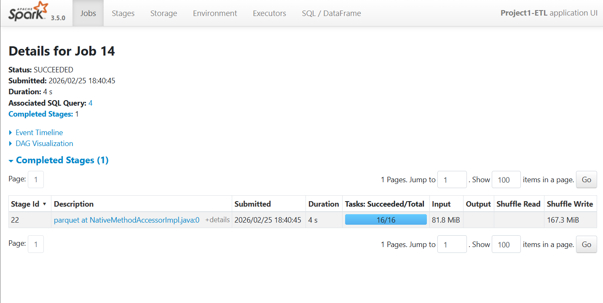
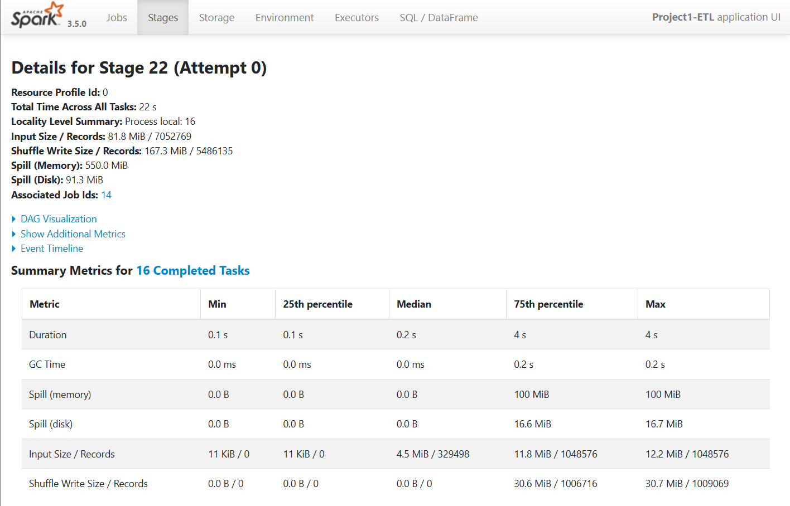
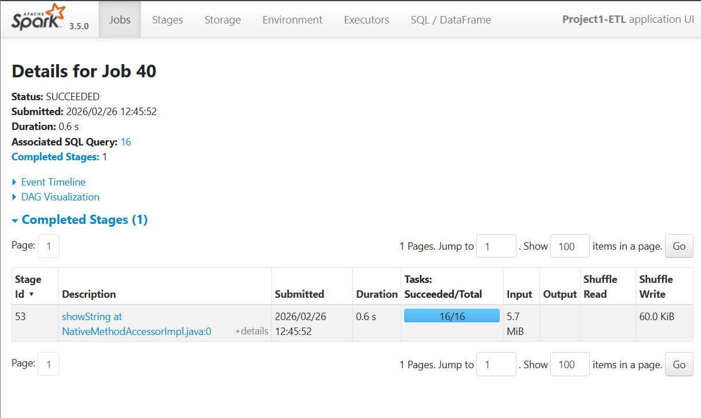
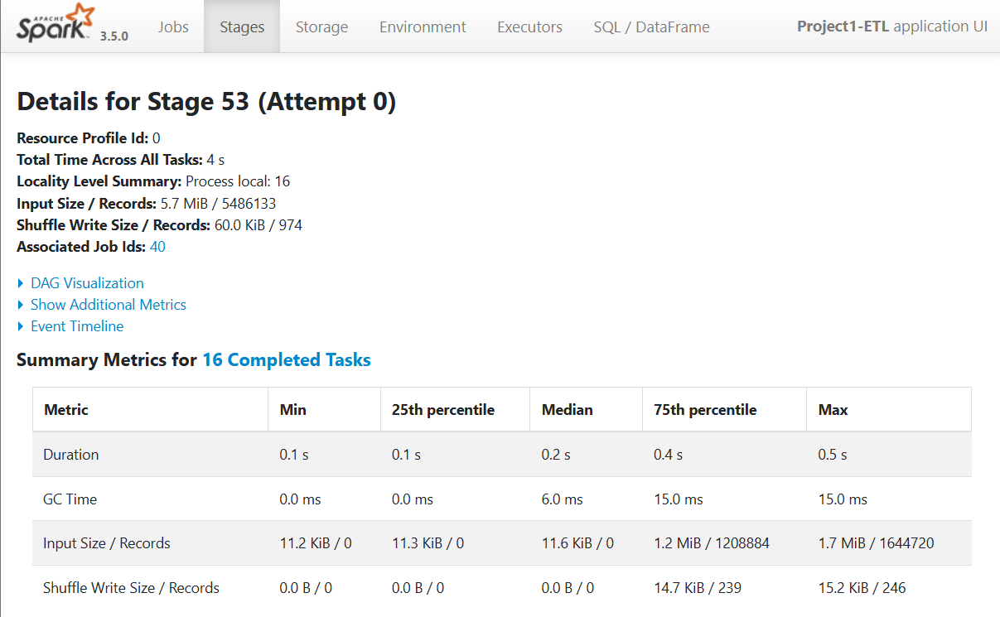
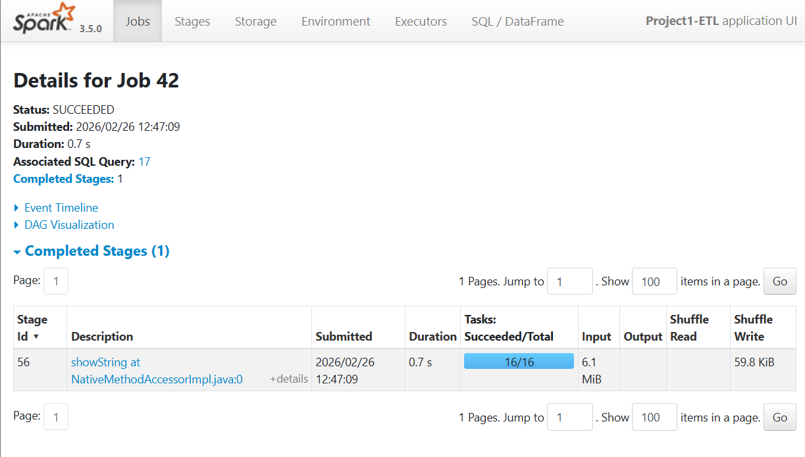

# 🚕 Incremental ETL Pipeline – NYC Taxi Trips

## Overview

This project implements an incremental and idempotent ETL pipeline in PySpark to process NYC Taxi trip data stored in monthly Parquet files.

The pipeline includes:

- Incremental ingestion controlled by a manifest file  
- Schema normalization and type casting  
- Data validation and cleaning  
- Batch-level and cross-run deduplication  
- Enrichment using taxi zone lookup  
- Derived feature computation  
- Optimized Parquet output writing  

The system guarantees correctness across multiple executions and processes only new files added to the `inbox` directory.

---

# 1️⃣ Correctness

## Row Counts (New Batch)

| Stage | Rows |
|-------|------|
| Input | 7,052,769 |
| After cleaning | 5,579,927 |
| After deduplication | 5,486,133 |
| Final output written | 5,486,133 |

### Observations

- ~1.47M rows were removed due to invalid or inconsistent data.
- ~93K duplicate rows were removed.
- The final output matches the post-deduplication count, confirming correctness and idempotency.

---

## Cleaning Rules Applied

Rows were removed when:

- Required fields were null  
- `passenger_count <= 0`  
- `trip_distance <= 0`  
- `tpep_dropoff_datetime <= tpep_pickup_datetime`  

These constraints ensure logical trip consistency and eliminate corrupted operational records.

---

## Examples of Invalid Trips (Bad Rows)

### Example 1 — Zero Distance & Zero Duration

| passenger_count | trip_distance | tpep_pickup_datetime   | tpep_dropoff_datetime  |
|---:|---:|---|---|
| 1 | 0.0 | 2025-01-01 00:49:48 | 2025-01-01 00:49:48 |

**Problem:** `trip_distance = 0` and `dropoff_datetime = pickup_datetime` → duration = 0  
**Rule applied:** removed because `trip_distance <= 0` and `tpep_dropoff_datetime <= tpep_pickup_datetime`.

---

### Example 2 — Negative Duration (Dropoff Before Pickup)

| passenger_count | trip_distance | tpep_pickup_datetime   | tpep_dropoff_datetime  |
|---:|---:|---|---|
| 1 | 9.0 | 2025-01-02 12:26:00 | 2025-01-02 11:29:58 |

**Problem:** dropoff happens **before** pickup.  
**Rule applied:** removed because `tpep_dropoff_datetime <= tpep_pickup_datetime`.

---

### Example 3 — Invalid Passenger Count

| passenger_count | trip_distance | tpep_pickup_datetime   | tpep_dropoff_datetime  |
|---:|---:|---|---|
| 0 | 0.4 | 2025-01-01 00:14:47 | 2025-01-01 00:16:15 |

**Problem:** `passenger_count = 0`.  
**Rule applied:** removed because `passenger_count <= 0`.

---

## Deduplication Strategy

**Deduplication key:**

```python
['VendorID',
 'tpep_pickup_datetime',
 'tpep_dropoff_datetime',
 'PULocationID',
 'DOLocationID']
```

Two layers of deduplication were implemented:

1. `dropDuplicates()` within the current batch  
2. `left_anti` join against previously written OUTBOX records  

This guarantees idempotency even if the pipeline is re-run or files are reintroduced.

---

# 2️⃣ Performance

## Full Job Runtime

**Full job runtime:** 4 seconds  

Measured from the Spark UI Job overview (Job 14).

---

## Spark UI Evidence

### Spark UI — Job Overview



### Spark UI — Stage Details (Shuffle, Spill & Task Distribution)



---

## Key Observations from Aggregation Stage (Stage 22)

- Total input processed: **81.8 MiB**
- Shuffle Write: **167.3 MiB**
- Spill (Memory): **550.0 MiB**
- Spill (Disk): **91.3 MiB**
- 16 shuffle tasks executed
- Median task duration: **0.2 s**
- Max task duration: **4 s**
- Median input per task: **~4.5 MiB**
- Max input per task: **~12.2 MiB**
- Max shuffle write per task: **~30.7 MiB**

---

## Interpretation

The aggregation stage triggered a heavy shuffle operation.

Key performance characteristics:

- Shuffle output (167.3 MiB) exceeded input size (81.8 MiB), indicating a wide transformation.
- Significant **memory spill (550 MiB)** and **disk spill (91.3 MiB)** show that shuffle exceeded executor memory capacity.
- The noticeable gap between median task duration (0.2 s) and maximum task duration (4 s) indicates uneven workload distribution across partitions.

This demonstrates:

- Real shuffle cost
- Memory pressure during aggregation
- Partition imbalance leading to slower straggler tasks

---

## Optimization 1 — Broadcast Join

The taxi zone lookup table was broadcasted:

```python
.join(broadcast(zones_pickup), ...)
```

### Impact

- Prevented shuffle of the small dimension table
- Reduced network I/O
- Lowered join overhead
- Ensured the heavy shuffle occurs only on the large dataset side

Broadcasting is appropriate because the lookup table is small relative to the trip dataset.

---

## Optimization 2 — Output Partition Control

```python
df_out.coalesce(4)
```

### Impact

- Reduced small-file problem
- Controlled number of output Parquet files
- Improved downstream read efficiency
- Lowered metadata overhead

---

## Performance Conclusion

The job exhibits:

- Significant shuffle cost
- Measurable spill to memory and disk
- Uneven task duration distribution

These metrics confirm that aggregation is the dominant performance bottleneck in the pipeline.

Spark UI evidence clearly demonstrates real-world distributed processing behavior, including shuffle amplification and memory pressure.

---

# 3️⃣ Custom Scenario — Skew Analysis

## Objective

This scenario evaluates whether the most frequent `pickup_zone` introduces data skew
during aggregation and whether skew mitigation techniques improve performance.

---

## 1️⃣ Identifying the Most Frequent Pickup Zone

We computed the distribution of `pickup_zone` and identified:

- **Upper East Side South**
- **286,719 records**
- **~5.23% of total dataset**

Although this is the most frequent key, its dominance is relatively low.
Severe skew typically occurs when a key represents a significantly larger share
(e.g., 20–40% of the dataset).

---

## 2️⃣ Baseline Aggregation

Aggregation executed:

```python
baseline_agg.orderBy(desc("count")).show(10, truncate=False)
```

### Spark UI — Baseline Job



### Spark UI — Baseline Stage



### Baseline Metrics (Job 40 / Stage 53)

- Runtime: **0.6 s**
- Input: **5.7 MiB**
- Shuffle Write: **60.0 KiB**
- 16 tasks executed
- Median task duration: **0.2 s**
- Max task duration: **0.5 s**
- No spill (memory or disk)

### Interpretation

Spark UI shows:

- Small shuffle volume
- Narrow gap between median and max task duration
- No straggler tasks
- No spill

This indicates balanced task execution and low skew impact.

---

## 3️⃣ Repartition-Based Skew Mitigation Attempt

We tested explicit repartitioning by key before aggregation:

```python
repart_agg = (
    df_scn
    .repartition("pickup_zone")      
    .groupBy("pickup_zone")
    .count()
)

repart_agg.orderBy(desc("count")).show(10, truncate=False)
```

This forces an additional shuffle to redistribute rows by `pickup_zone`
before performing the aggregation.

### Spark UI — Repartition Job



### Spark UI — Repartition Stage


### Observed Metrics (Job 42 / Stage 56)

- Runtime: **0.7 s**
- Input: **6.1 MiB**
- Shuffle Write: **59.8 KiB**
- 16 tasks executed
- Median task duration: **0.1 s**
- Max task duration: **0.6 s**
- No spill

### Interpretation

Repartitioning introduced an additional shuffle phase without improving task balance.

- Runtime slightly increased (0.6 s → 0.7 s)
- Shuffle volume remained similar
- Task duration distribution remained balanced
- No spill occurred in either case

This confirms that repartitioning does not improve performance in this scenario.

---

# Incremental & Idempotent Design

- `manifest.json` tracks processed files  
- Only new files in `inbox/` are processed  
- Re-running without new files produces no changes  
- Anti-join prevents duplicate writes across executions  

---

# Output Schema

The final dataset includes:

- Pickup and dropoff timestamps  
- Pickup and dropoff LocationID  
- Pickup and dropoff zone names  
- passenger_count  
- trip_distance  
- trip_duration_minutes  
- pickup_date  
- source_file  
- ingested_at  

---

# Final Remarks

This project demonstrates:

- Scalable ETL design with incremental ingestion  
- Strong correctness guarantees  
- Practical use of Spark UI for performance analysis  
- Real shuffle and spill investigation  
- Empirical skew analysis with measured conclusions  
- Application of distributed data engineering best practices  