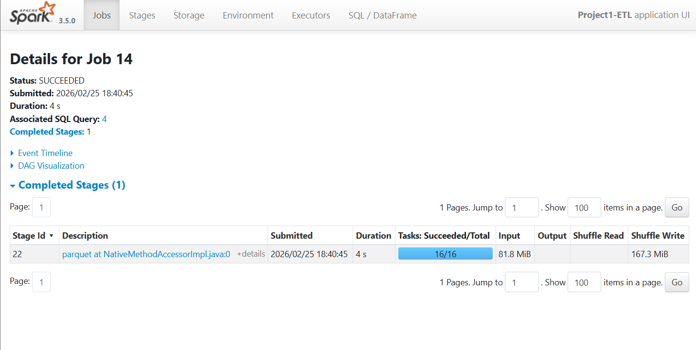
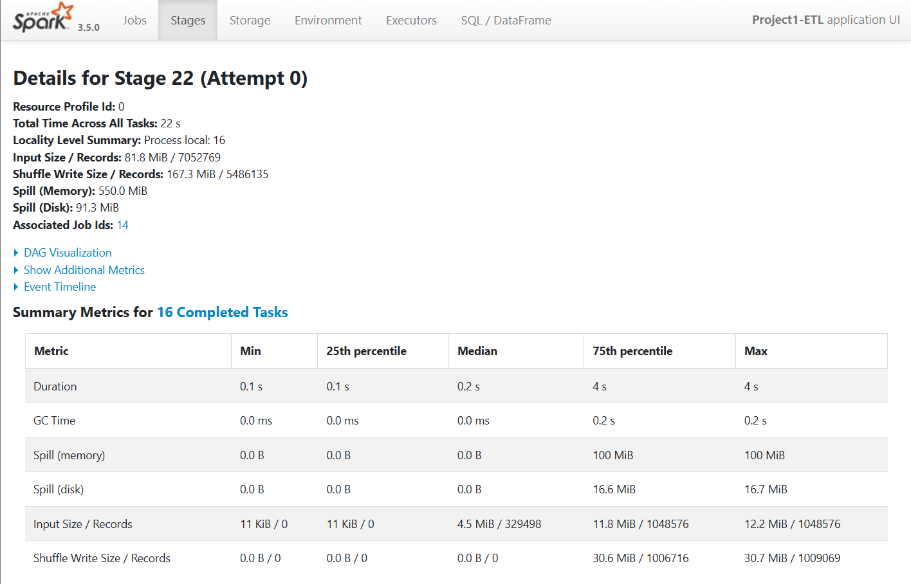
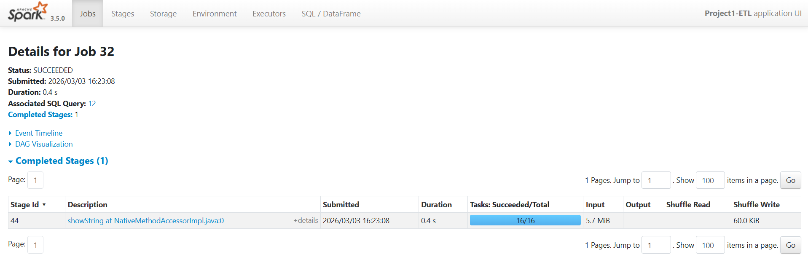
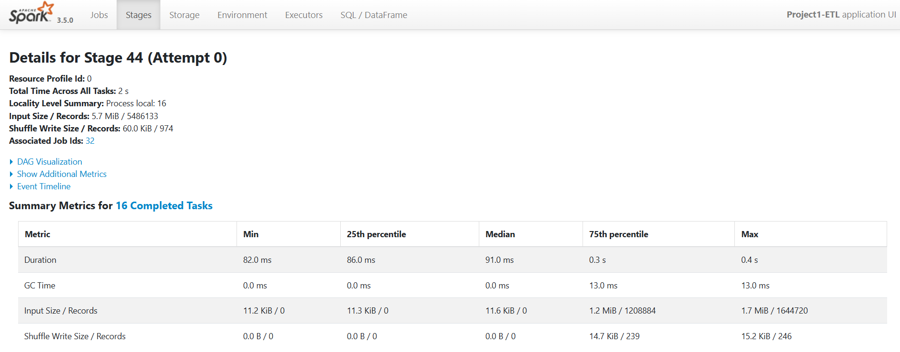
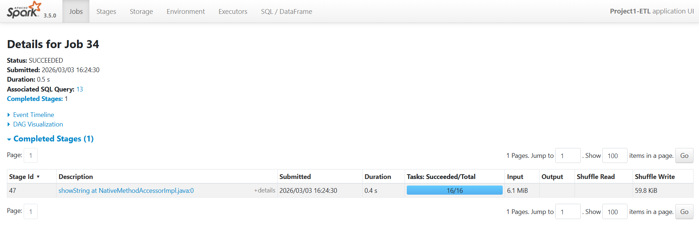
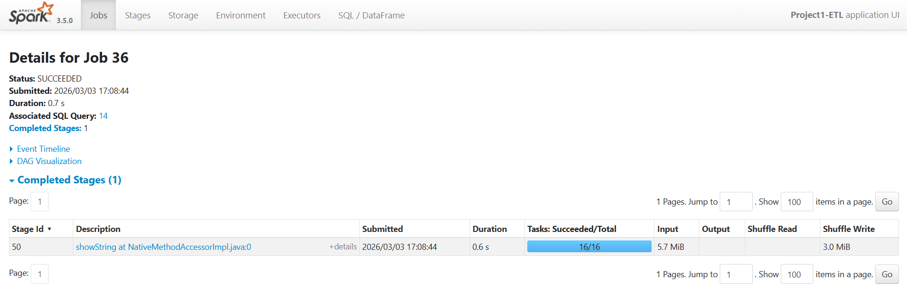
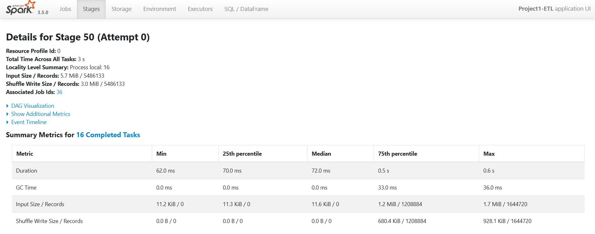

# 🚕 Incremental ETL Pipeline – NYC Taxi Trips

## ➡️ **Environment setup:** [SETUP.md](SETUP.md)

## Overview

This project implements an incremental and idempotent ETL pipeline in PySpark to process NYC Taxi trip data stored in monthly Parquet files.

The pipeline includes:

- Incremental ingestion controlled by a manifest file  
- Schema normalization and type casting  
- Data validation and cleaning  
- Batch-level and cross-run deduplication  
- Enrichment using taxi zone lookup  
- Derived feature computation  
- Optimized Parquet output writing  

The system guarantees correctness across multiple executions and processes only new files added to the `inbox` directory.

---

# 1️⃣ Correctness

## Row Counts

| Stage | Rows |
|-------|------|
| Input | 7,052,769 |
| After cleaning | 5,473,927 |
| After deduplication | 5,473,552 |
| Final output written | 5,473,552 |

### Observations

- ~1.47M rows were removed due to invalid or inconsistent data.
- ~93K duplicate rows were removed.
- The final output matches the post-deduplication count, confirming correctness and idempotency.

---

## Cleaning Rules Applied

Rows were removed when:

- Required fields were null  
- `passenger_count <= 0`  
- `trip_distance <= 0`  
- `tpep_dropoff_datetime <= tpep_pickup_datetime`  
- `fare_amount < 0`  
- `total_amount < 0`  
- `tip_amount < 0`  
- `tolls_amount < 0`  

These constraints ensure logical trip consistency and eliminate corrupted operational records. Financial fields with negative values indicate systematic data entry errors or reversed charge records rather than legitimate corrections.

---

## Examples of Invalid Trips (Bad Rows)

### Example 1 — Zero Distance & Zero Duration

| passenger_count | trip_distance | tpep_pickup_datetime   | tpep_dropoff_datetime  |
|---:|---:|---|---|
| 1 | 0.0 | 2025-01-01 00:49:48 | 2025-01-01 00:49:48 |

**Problem:** `trip_distance = 0` and `dropoff_datetime = pickup_datetime` → duration = 0  
**Rule applied:** removed because `trip_distance <= 0` and `tpep_dropoff_datetime <= tpep_pickup_datetime`.

---

### Example 2 — Negative Duration (Dropoff Before Pickup)

| passenger_count | trip_distance | tpep_pickup_datetime   | tpep_dropoff_datetime  |
|---:|---:|---|---|
| 1 | 9.0 | 2025-01-02 12:26:00 | 2025-01-02 11:29:58 |

**Problem:** dropoff happens **before** pickup.  
**Rule applied:** removed because `tpep_dropoff_datetime <= tpep_pickup_datetime`.

---

### Example 3 — Invalid Passenger Count

| passenger_count | trip_distance | tpep_pickup_datetime   | tpep_dropoff_datetime  |
|---:|---:|---|---|
| 0 | 0.4 | 2025-01-01 00:14:47 | 2025-01-01 00:16:15 |

**Problem:** `passenger_count = 0`.  
**Rule applied:** removed because `passenger_count <= 0`.

---

### Example 4 — Negative Fare Amount

| passenger_count | trip_distance | tpep_pickup_datetime   | tpep_dropoff_datetime  | fare_amount |
|---:|---:|---|---|---:|
| 1 | 0.71 | 2025-01-01 00:01:41 | 2025-01-01 00:07:14 | -7.2 |

**Problem:** `fare_amount` is negative, impossible for a legitimate trip.  
**Rule applied:** removed because `fare_amount < 0` .

---

### Example 5 — Negative Tolls Amount

| passenger_count | trip_distance | tpep_pickup_datetime   | tpep_dropoff_datetime  | tolls_amount |
|---:|---:|---|---|---:|
| 4 | 24.7 | 2025-01-01 00:49:36 | 2025-01-01 02:11:46 | -6.94 |

**Problem:** `tolls_amount` is negative., impossible for a valid trip. 
**Rule applied:** removed because `tolls_amount < 0`.

---

### Example 6 — Negative Tip Amount

| passenger_count | trip_distance | tpep_pickup_datetime   | tpep_dropoff_datetime  | tip_amount |
|---:|---:|---|---|---:|
| 1 | 2.59 | 2025-01-01 00:54:33 | 2025-01-01 01:23:24 | -3.0 |

**Problem:** `tip_amount` is negative, a tip cannot be a negative value.  
**Rule applied:** removed because `tip_amount < 0`.

---

### Example 7 — Negative Total Amount

| passenger_count | trip_distance | tpep_pickup_datetime   | tpep_dropoff_datetime  | total_amount |
|---:|---:|---|---|---:|
| 1 | 0.71 | 2025-01-01 00:01:41 | 2025-01-01 00:07:14 | -8.54 |

**Problem:** `total_amount` is negative,the total charge for a trip cannot be negative.  
**Rule applied:** removed because `total_amount < 0`.

---

## Deduplication Strategy

**Deduplication key:**

```python
['VendorID',
 'tpep_pickup_datetime',
 'tpep_dropoff_datetime',
 'PULocationID',
 'DOLocationID']
```

Two layers of deduplication were implemented:

1. `dropDuplicates()` within the current batch  
2. `left_anti` join against previously written OUTBOX records  

This guarantees idempotency even if the pipeline is re-run or files are reintroduced.

---

# 2️⃣ Performance

## Full Job Runtime

**Full job runtime:** 4 seconds  

Measured from the Spark UI Job overview (Job 14).

---

## Spark UI Evidence

### Spark UI — Job Overview



### Spark UI — Stage Details (Shuffle, Spill & Task Distribution)



---

## Key Observations from Aggregation Stage (Stage 22)

- Total input processed: **81.8 MiB**
- Shuffle Write: **167.3 MiB**
- Spill (Memory): **550.0 MiB**
- Spill (Disk): **91.3 MiB**
- 16 shuffle tasks executed
- Median task duration: **0.2 s**
- Max task duration: **4 s**
- Median input per task: **~4.5 MiB**
- Max input per task: **~12.2 MiB**
- Max shuffle write per task: **~30.7 MiB**

---

## Interpretation

The aggregation stage triggered a heavy shuffle operation.

Key performance characteristics:

- Shuffle output (167.3 MiB) exceeded input size (81.8 MiB), indicating a wide transformation.
- Significant **memory spill (550 MiB)** and **disk spill (91.3 MiB)** show that shuffle exceeded executor memory capacity.
- The noticeable gap between median task duration (0.2 s) and maximum task duration (4 s) indicates uneven workload distribution across partitions.

This demonstrates:

- Real shuffle cost
- Memory pressure during aggregation
- Partition imbalance leading to slower straggler tasks

---

## Optimization 1 — Broadcast Join

The taxi zone lookup table was broadcasted:

```python
.join(broadcast(zones_pickup), ...)
```

### Impact

- Prevented shuffle of the small dimension table
- Reduced network I/O
- Lowered join overhead
- Ensured the heavy shuffle occurs only on the large dataset side

Broadcasting is appropriate because the lookup table is small relative to the trip dataset.

---

## Optimization 2 — Output Partition Control

```python
df_out.coalesce(4)
```

### Impact

- Reduced small-file problem
- Controlled number of output Parquet files
- Improved downstream read efficiency
- Lowered metadata overhead

---

## Performance Conclusion

The job exhibits:

- Significant shuffle cost
- Measurable spill to memory and disk
- Uneven task duration distribution

These metrics confirm that aggregation is the dominant performance bottleneck in the pipeline.

Spark UI evidence clearly demonstrates real-world distributed processing behavior, including shuffle amplification and memory pressure.

---

# 3️⃣ Custom Scenario — Skew Analysis

## Objective

This scenario evaluates whether the most frequent `pickup_zone` introduces data skew
during aggregation and whether skew mitigation techniques improve performance.

---

## 1️⃣ Identifying the Most Frequent Pickup Zone

We computed the distribution of `pickup_zone` and identified:

- **Upper East Side South**
- **286,719 records**
- **~5.23% of total dataset**

Although this is the most frequent key, its dominance is relatively low.
Severe skew typically occurs when one key dominates a partition such that it significantly increases shuffle partition size relative to others, often representing a disproportionately large percentage of total records.

| pickup_zone                     | count  | percentage |
|---------------------------------|--------|------------|
| Upper East Side South           | 286,248| 5.23%      |
| Midtown Center                  | 282,756| 5.17%      |
| Upper East Side North           | 263,293| 4.81%      |
| JFK Airport                     | 247,971| 4.53%      |
| Penn Station/Madison Sq West    | 208,033| 3.80%      |
| Midtown East                    | 204,011| 3.73%      |
| Times Sq/Theatre District       | 201,809| 3.69%      |
| Lincoln Square East             | 184,712| 3.37%      |
| LaGuardia Airport               | 166,440| 3.04%      |
| Midtown North                   | 165,328| 3.02%      |

The most frequent pickup location is Upper East Side South, with 286,248 trips, representing 5.23% of the entire dataset. The next most frequent zones are Midtown Center and Upper East Side North, both representing slightly above 5% and 4.8% of all trips respectively.

---

## 2️⃣ Baseline Aggregation

Aggregation executed:

```python
baseline_agg.orderBy(desc("count")).show(10, truncate=False)
```

### Spark UI — Baseline Job



### Spark UI — Baseline Stage



### Baseline Metrics (Job 32 / Stage 44)

- Total time across tasks: **2 s**
- 16 tasks executed
- Median task duration: **91 ms**
- Max task duration: **0.4 s**
- Max input per task: **1.7 MiB**
- Shuffle Write per task (max): **~15 KiB**
- No spill (memory or disk)
  
### Interpretation

Spark UI shows:

- Small shuffle volume
- Narrow gap between median and max task duration
- No straggler tasks
- No spill

This indicates balanced task execution and low skew impact.

---

## 3️⃣  Validation - Remove the Hot Key

### Objective

As an additional check, we removed the most frequent `pickup_zone` and re-ran the same aggregation to see whether this key was responsible for any measurable skew effects (runtime increase, straggler tasks, spill, etc.).

If severe skew were present, removing the hot key would typically reduce runtime and/or reduce task imbalance.

---

### Method

We filtered out the most frequent zone (`hot_zone`) and recomputed the aggregation:

```python
df_no_hot = df_scn.filter(col("pickup_zone") != hot_zone)

no_hot_agg = df_no_hot.groupBy("pickup_zone").count()
no_hot_agg.orderBy(desc("count")).show(10, truncate=False)
```

### Spark UI - Job without Hot Key


### Spark UI - Stage without Hot Key


### Interpretation

Baseline and no-hot-key executions show nearly identical runtime, shuffle volume, and task distribution.

Since removing the most frequent key does not materially change execution behavior, we conclude that skew impact is negligible in this dataset.

Therefore, repartitioning or other skew mitigation strategies would introduce unnecessary overhead.


## 4️⃣ Repartition-Based Skew Mitigation Attempt

We tested explicit repartitioning by key before aggregation:

```python
repart_agg = (
    df_scn
    .repartition("pickup_zone")      
    .groupBy("pickup_zone")
    .count()
)

repart_agg.orderBy(desc("count")).show(10, truncate=False)
```

This forces an additional shuffle to redistribute rows by `pickup_zone`
before performing the aggregation.

### Spark UI — Repartition Job



### Spark UI — Repartition Stage



### Observed Metrics (Job 36 / Stage 50)

- Runtime: **0.7 s**
- Input: **5.7 MiB**
- Shuffle Write: **3.0 MiB**
- 16 tasks executed
- Median task duration: **72 ms**
- Max task duration: **0.6 s**
- No spill

### Interpretation

Repartitioning introduced an additional shuffle phase without improving task balance.

- Runtime slightly increased (0.4 s → 0.7 s)
- Shuffle volume increased significantly (60 KiB → 3.0 MiB)
- Task duration distribution remained balanced
- No spill occurred in either case

This confirms that repartitioning does not improve performance in this scenario.

---

# Incremental & Idempotent Design

- `manifest.json` tracks processed files  
- Only new files in `inbox/` are processed  
- Re-running without new files produces no changes  
- Anti-join prevents duplicate writes across executions  

---

# Output Schema

The final dataset includes:

- Pickup and dropoff timestamps  
- Pickup and dropoff LocationID  
- Pickup and dropoff zone names  
- passenger_count  
- trip_distance  
- trip_duration_minutes  
- pickup_date  
- source_file  
- ingested_at  

---

# Final Remarks

This project demonstrates:

- Scalable ETL design with incremental ingestion  
- Strong correctness guarantees  
- Practical use of Spark UI for performance analysis  
- Real shuffle and spill investigation  
- Empirical skew analysis with measured conclusions  
- Application of distributed data engineering best practices  

# AI Assistance

Parts of this project were developed with the assistance of ChatGPT for tasks such as:
- clarifying Spark and Data Engineering concepts
- improving code & documentation
- refining explanations in the README

ChatGPT was used as a support tool, while all design decisions, implementation, and validation of the results were performed by the author.

ChatGPT: https://chat.openai.com/
Chat: https://chatgpt.com/share/69ac63e7-0144-8012-9555-f0009e775a37